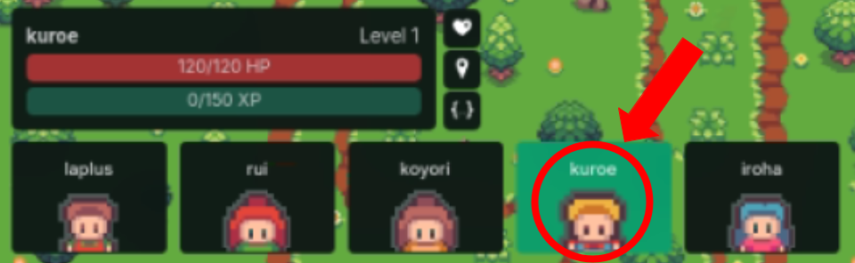

# 実験参加者マニュアル

本実験へのご協力ありがとうございます。
このドキュメントは、実験で使用するプラットフォームの基本操作、および割り当てられるタスクの遂行手順について説明するものです。

実験の公平性を保つため、開始前に必ずご一読ください。

---

## 1. 実験の流れ
本実験では、以下の2つのフェーズを順番に行います。

1.  **タスク遂行フェーズ**
    * 外部サービスArtifacts (https://docs.artifactsmmo.com) 内で行います。
    * 割り当てられた目標アイテムの収集や作成を行います。
    * 初期タスクが終了次第、残り時間は自由行動です。
3.  **会話・推論フェーズ**
    * 自分以外の「4人」とチャットで会話を行います。
    * 先に会話をする順番、会話相手の順番はすべてランダムです。
    * 会話を通じて情報交換を行ったり、PC / NPC の判別をしたりします。

> ⚠️ 重要 ⚠️
> 
> **タスクの制限時間は8分です。**
> 
> **チャットは 30秒毎に自動送信されます（3往復・計6回 × 4人分 = 12分）。**
>
> **チャットで会話を行う「前」と「後」それぞれで、「どのキャラがPC (Player Character)であるか」を予想してもらいます。Forms([回答用URL](https://forms.office.com/Pages/ResponsePage.aspx?id=RQbIut33KkaF68U3I3it8emwe9XjxFhIlD1Rd1IFcxtUN1JaS1BJNk4yTktKTDVGQTc4UFlSQUMzUi4u))に書くか記憶しておいてください。**

---

## 2. タスク遂行フェーズのルール
あなたには、以下のいずれかのアイテムを入手するタスクがランダムで割り当てられます。
システム内のアイテム名や場所は**すべて英語**で表記されています。以下の表を参照し、日本語の意味と入手方法を確認してください。
左上「説明ボタン」でいつでも確認できます。

### A. 採取・採掘・釣り (Gathering / Mining / Fishing)
フィールド上の特定の資源ポイントへ移動し、アクションを行うことで入手します。

| アイテム名 (英語) | 日本語訳 | 座標 (X, Y) | 入手ルート・詳細 |
| :--- | :--- | :--- | :--- |
| **Ash Wood** | 木材 | **(-1, 0)** | **[伐採]** 対象座標に移動し、アクションを実行して入手。 |
| **Apple** | リンゴ | **(-1, 0)** | **[採取]** 対象座標に移動し、アクションを実行して低確率で入手。 |
| **Copper Ore** | 銅鉱石 | **(2, 0)** | **[採掘]** 対象座標に移動し、アクションを実行して入手。 |
| **Sunflower** | ヒマワリ | **(2, 2)** | **[採取]** 対象座標に移動し、アクションを実行して入手。 |
| **Gudgeon** | ガジョン (魚) | **(4, 2)** | **[釣り]** 対象座標に移動し、アクションを実行して入手。 |
| **Algae** | 藻 (モ) | **(4, 2)** | **[釣り]** 対象座標に移動し、アクションを実行して低確率で入手。 |

### B. 戦闘・ドロップ (Combat / Drops)
フィールド上のモンスターシンボルと接触して戦闘を行い、勝利することで入手します。失った体力は左下HP右上の♡マークで回復できます。

| アイテム名 (英語) | 日本語訳 | 座標 (X, Y) | 入手ルート・詳細 |
| :--- | :--- | :--- | :--- |
| **Chicken** | 鶏 (肉/卵) | **(0, 1)** | **[戦闘]** 対象座標に移動し、戦闘に勝利してドロップを入手。 ※卵 (Egg) が必要な場合もこのルートです。 |
| **Cow** | 牛 (肉/牛乳) | **(0, 2)** | **[戦闘]** 対象座標に移動し、戦闘に勝利してドロップを入手。 |

### C. クラフト・料理 (Crafting / Cooking)
素材を集めた後、特定の設備（ワークショップ）に移動して作成します。

| アイテム名 (英語) | 日本語訳 | 座標 (X, Y) | 入手ルート・詳細 |
| :--- | :--- | :--- | :--- |
| **Wooden Staff** | 木の杖 | **(2, 1)** | **[木工]**  1. **Ash Wood** を4つ採取する。 2. 対象座標(Workshop)に移動する。 3. Craftを実行して作成。 |
| **Fried Eggs** | 目玉焼き | **(1, 1)** | **[料理]**  1. Chickenから **Egg** を2つ入手する。 2. 対象座標(Workshop)に移動する。 3. 料理を実行して作成。 |
| **Cooled Chicken** | 調理した鶏肉 | **(1, 1)** | **[料理]**  1. Chickenから **Raw Chicken** を1つ入手する。 2. 対象座標(Workshop)に移動する。 3. 料理を実行して作成。 |
| **Small Health Potion** | 小回復薬 | **(2, 3)** | **[錬金術]**  1. **Sunflower** を3つ採取する。 2. 対象座標(Workshop)に移動する。 3. 調合を実行して作成。 |

*図1：Artifactsでのキャラクターの動かし方　(例：kuroe)*

画面左下、自身のキャラクターを図1のようにクリックしてから操作してください。
各操作にはクールダウンタイムが長めに設けられています。待ち時間にはサイトの情報からNPCとPCの判別を行ってください。

---

## 3. 会話・推論フェーズのルール
タスク遂行中、チャット画面を通じてパートナーと会話を行います。以下のルールに従って会話してください。

### 推論タスクについて
* あなたとパートナーには、それぞれ**別のタスク**が割り当てられています。
* 「相手が何のタスクを行っているか（何を集めているか）」など、タスク遂行フェーズに関連の高い会話をしてください。
* 同時に、相手からの質問に対しては、自分のタスクの進捗や内容を共有して構いません。

### 用語の統一（重要）
システム上の固有名詞（アイテム名、キャラクター名など）については、できれば**翻訳せず英語表記のまま**発言してください。

* **良い例**:
    * 「**Ash Wood** を集めるの大変だったよ」
    * 「あなたのタスクはなんでしたか？」
* **悪い例**:
    * 「木材を集めています。」　（英語表記が望ましい）
    * 「明日の予定は？」　（人間とバレない行動を心がけてください）

※ それ以外の日常会話は、通常の日本語で行ってください。

---

## 4. その他・注意事項
* **操作トラブル**: 画面が反応しない、ローディングが終わらない等の場合は、ブラウザのリロード（再読み込み）を試してください。
* **ログの扱い**: 実験中の行動ログおよびチャット内容は、分析のためにサーバーへ記録されます。個人を特定する情報は公開されません。

ご協力ありがとうございます。準備ができ次第、実験を開始してください。